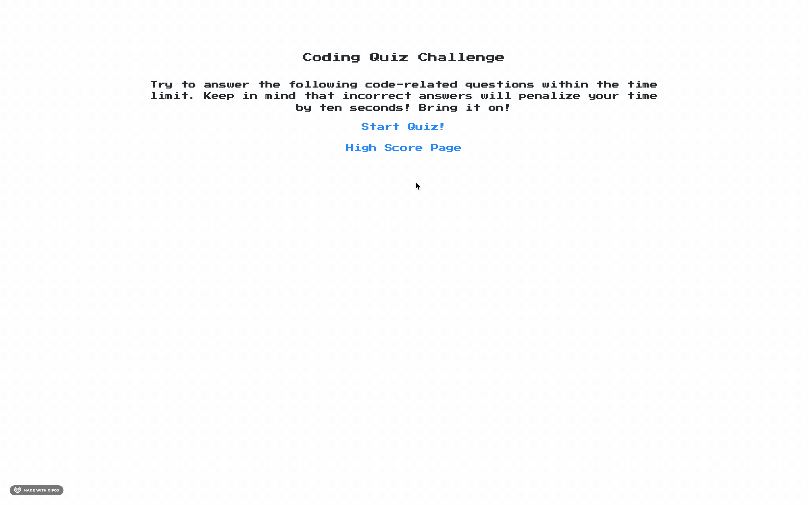

<p align="center">
A quiz about all things Javascript. Are you up for the challenge? 
</p>

Deployed Application: https://neylonmc.github.io/Javascript-Coding-Quiz


## JavaScript Coding Quiz
### Description
  This timed code quiz is full of multiple-choice questions. This app is run in the browser and features dynamically updated HTML and CSS powered by JavaScript code. 
## Table of Contents

* [Usage](#usage)

* [Inside Look](#inside-look)
  
* [License](#license)
  
* [Contributing](#contributing)
  
* [Tests](#tests)
  
* [Questions?](#questions)


## Usage
Open the application in the browser: 
```
https://neylonmc.github.io/Javascript-Coding-Quiz/
```

## Inside Look
  


## License
  [](https://opensource.org/licenses/MIT)
  
## Contributing
N/A
  
## Tests
N/A 
  
## Questions? Contact Me
  GitHub: [neylonmc]("https://github.com/neylonmc")
  Email: [neylonmc@gmail.com]("mailto:neylonmc@gmail.com") 